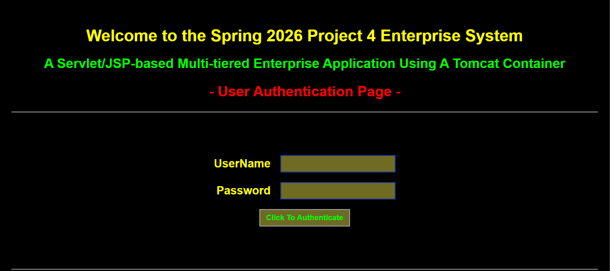
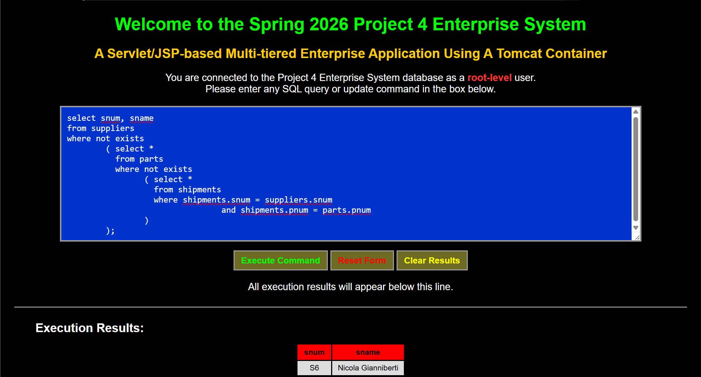
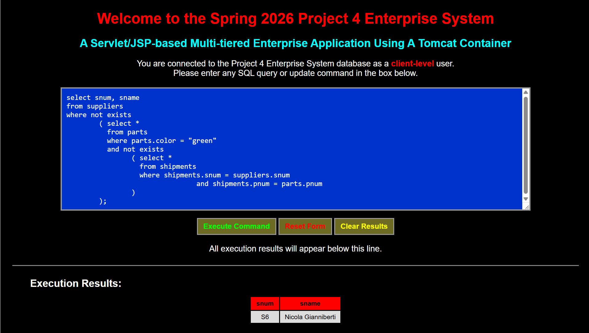
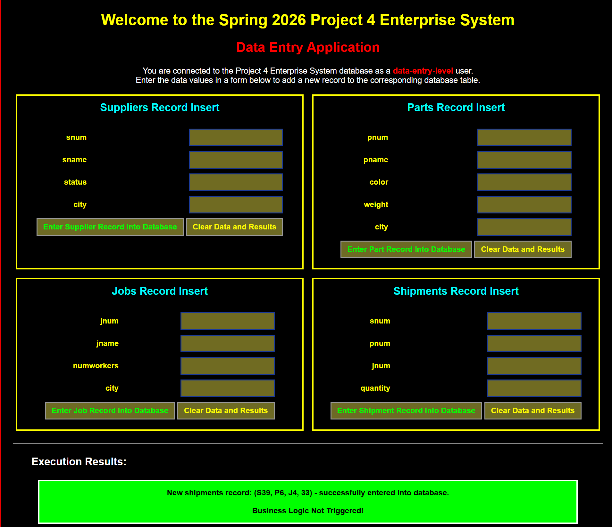
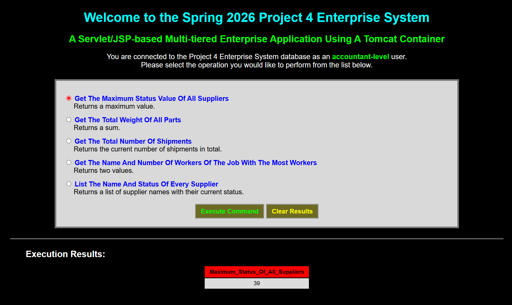
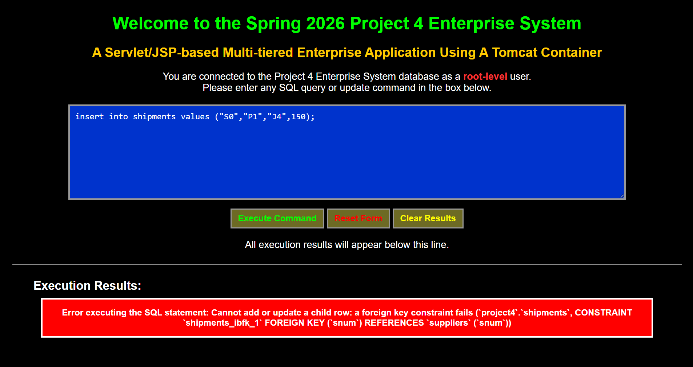

# Enterprise Database Management System

A three-tier enterprise web application developed using Java Servlets, JSP, JDBC, MySQL, and Apache Tomcat. The system implements role-based access control with multiple user interfaces for SQL execution, data entry operations, stored procedure reporting, and database administration.

---

## Features

- Role-Based Authentication System
- SQL Query Execution Interface
- JDBC Database Integration
- Stored Procedure Execution
- PreparedStatement Integration
- CallableStatement Integration
- Referential Integrity Enforcement
- Multi-Tier Enterprise Architecture
- Business Logic Validation
- CRUD Database Operations
- MySQL Relational Database Management
- Dynamic JSP Rendering
- Tomcat Deployment Environment

---

## System Architecture

This project implements a three-tier distributed enterprise system architecture.

### Frontend Tier
- JSP Pages
- HTML/CSS
- Dynamic user interfaces
- Role-based navigation

### Middle Tier
- Java Servlets
- JDBC connectivity
- Authentication processing
- Business logic implementation
- Request handling and validation

### Backend Tier
- MySQL Database Server
- Relational schema design
- Stored procedures
- Foreign key constraints
- Persistent enterprise data storage

---

## User Roles

The application supports four authenticated user types with different permission levels.

| Role | Capabilities |
|---|---|
| Root User | Full SQL query and update execution |
| Client User | Read-only SQL query operations |
| Data Entry User | Form-based insert operations using PreparedStatements |
| Accountant User | Stored procedure execution using CallableStatements |

---

## Tech Stack

### Frontend
- JSP
- HTML
- CSS

### Backend
- Java Servlets
- JDBC
- Apache Tomcat

### Database
- MySQL
- Stored Procedures
- Relational Database Design

---

## Key Concepts Demonstrated

- Three-tier enterprise architecture
- Role-based authentication and authorization
- Java Servlet development
- JSP dynamic rendering
- JDBC database connectivity
- SQL query execution
- PreparedStatement usage
- CallableStatement usage
- Stored procedure execution
- Referential integrity enforcement
- Business logic validation
- Exception handling
- MySQL relational database management
- Tomcat deployment configuration

---

## Application Screenshots

### Login Page


### Root-Level Administrative Interface


### Client SQL Query Interface


### Data Entry Interface


### Accountant Reporting Dashboard


### SQL Constraint Validation Example


---

## Database Features

The system implements relational database concepts including:

- Foreign key constraints
- Referential integrity validation
- Multi-table relational schema
- Stored procedures
- User permissions and access control
- Dynamic SQL processing
- Business rule enforcement

---

## My Contributions

This project was developed collaboratively as part of an enterprise systems and database management course.

My primary contributions included:

- JDBC database integration
- SQL query development
- Relational database implementation
- Authentication logic support
- Business logic validation
- Frontend JSP integration
- Enterprise system testing and debugging

---

## Installation

### Requirements

- Java JDK
- Apache Tomcat
- MySQL Server
- MySQL Connector/J

---

## Project Structure

```plaintext
src/
WEB-INF/
  lib/
Front-End-Pages/
screenshots/
authentication.html
project4.css
README.md
```

---

## Future Improvements

- Enhanced UI/UX design
- Improved error handling
- Expanded reporting features
- REST API integration
- Cloud deployment support
- Advanced analytics dashboard

---

## Academic Context

Developed for Enterprise Database Systems - Spring 2026.
